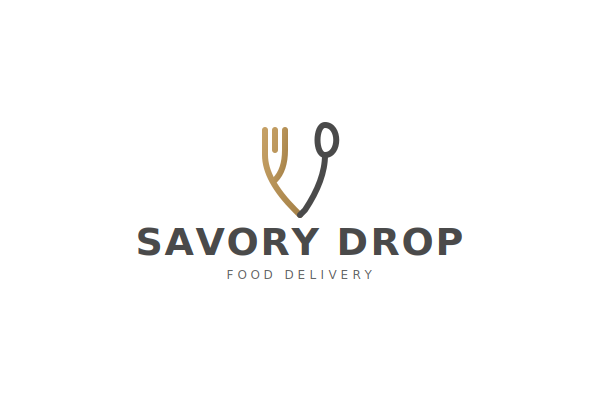

# 🍕 Savory Drop - Food Delivery App
## [Deployed Link](https://anshuman-food-delivery.vercel.app/)

A modern, feature-rich food delivery application built with React, TypeScript, and Vite. This project demonstrates best practices in React development including routing, custom hooks, lazy loading, and responsive design.



## 📋 Table of Contents

- [About](#about)
- [Features](#features)
- [Tech Stack](#tech-stack)
- [Project Structure](#project-structure)
- [Getting Started](#getting-started)
- [Key Concepts Implemented](#key-concepts-implemented)
- [Custom Hooks](#custom-hooks)
- [Routing](#routing)
- [Future Enhancements](#future-enhancements)
- [Learning Outcomes](#learning-outcomes)

## 🎯 About

Savory Drop is a Swiggy-inspired food delivery application that allows users to browse restaurants, view menus, search for specific restaurants, and filter top-rated options. This project was built as a learning exercise to understand modern React patterns and best practices.

## ✨ Features

- **Restaurant Browsing**: View a curated list of restaurants with ratings, cuisines, and delivery times
- **Search Functionality**: Real-time search to find restaurants by name
- **Top Rated Filter**: Filter restaurants with ratings ≥ 4 stars
- **Restaurant Menu**: Detailed menu page for each restaurant with items, prices, and descriptions
- **Online Status Indicator**: Visual indicator showing connection status
- **Responsive Design**: Mobile-friendly UI with Tailwind CSS
- **Shimmer Loading**: Elegant loading states for better UX
- **Lazy Loading**: Code-splitting for optimal performance
- **GitHub Integration**: Dynamic About page fetching GitHub user data
- **Error Handling**: Custom error page for route errors

## 🛠️ Tech Stack

### Build Tools & Runtime
- **Bun** - Fast all-in-one JavaScript runtime and package manager
- **Vite 7.2.4** - Lightning-fast build tool and development server

### Core Technologies
- **React 19.2.0** - UI library
- **TypeScript** - Type safety and better developer experience
- **React Router DOM 7.13.0** - Client-side routing

### Styling
- **Tailwind CSS 4.1.18** - Utility-first CSS framework
- **Custom CSS** - Component-specific styles

### Development Tools
- **ESLint** - Code linting
- **TypeScript ESLint** - TypeScript-specific linting rules

## 📁 Project Structure

```
FoodDeliveryApp/
├── public/
│   ├── cart.svg              # Cart icon
│   ├── favicon.svg           # App favicon
│   └── logo.svg              # App logo
├── src/
│   ├── Components/
│   │   ├── About/            # About page with GitHub integration
│   │   ├── Body/             # Main restaurant listing page
│   │   │   └── RestaurantCard/  # Individual restaurant card
│   │   ├── Contact/          # Contact page
│   │   ├── ErrorPage/        # 404 and error handling
│   │   ├── Footer/           # App footer
│   │   ├── Grocery/          # Lazy-loaded grocery section
│   │   ├── Header/           # Navigation header
│   │   ├── Login/            # Login/Logout button
│   │   ├── RestaurantMenuPage/  # Restaurant menu details
│   │   ├── Shimmer/          # Loading skeleton
│   │   └── UserPage/         # User profile display
│   ├── Hooks/
│   │   ├── useOnlineStatus.ts    # Network status hook
│   │   └── useRestaurantMenu.ts  # Restaurant menu data hook
│   ├── utils/
│   │   ├── MenuData.json     # Sample menu data
│   │   └── RestaurantData.json  # Sample restaurant data
│   ├── App.tsx               # Root component
│   ├── main.tsx              # Application entry point
│   └── index.css             # Global styles
├── package.json
├── tsconfig.json
└── vite.config.ts
```

## 🚀 Getting Started

### Prerequisites

- **Bun** (v1.0 or higher) - Fast JavaScript runtime and package manager
  - Install from [bun.sh](https://bun.sh)
- **Vite** - Already included as dev dependency

### Installation

1. **Clone the repository**
   ```bash
   git clone <repository-url>
   cd FoodDeliveryApp
   ```

2. **Install dependencies**
   ```bash
   bun install
   ```

3. **Set up environment variables**
   
   Create a `.env` file in the root directory:
   ```env
   VITE_CLOUDINARY_BASE_URL=https://media-assets.swiggy.com/swiggy/image/upload/fl_lossy,f_auto,q_auto,w_660/
   VITE_SWIGGY_API=<your-api-endpoint>
   ```

4. **Start the development server**
   ```bash
   bun run dev
   ```

5. **Open your browser**
   
   Navigate to `http://localhost:5173`

### Available Scripts

```bash
bun run dev      # Start Vite development server
bun run build    # Build for production with TypeScript check
bun run preview  # Preview production build
bun run lint     # Run ESLint
```

## 💡 Key Concepts Implemented

### 1. **Component Architecture**
- Functional components with TypeScript interfaces
- Proper component composition and reusability
- Separation of concerns (UI, logic, styling)

### 2. **State Management**
- `useState` for local component state
- Props drilling for data flow
- Controlled components for forms

### 3. **Side Effects**
- `useEffect` for data fetching
- Cleanup in event listeners
- Dependency arrays for optimization

### 4. **Custom Hooks**

#### `useOnlineStatus`
```typescript
// Monitors network connectivity
const onlineStatus = useOnlineStatus();
// Returns: boolean (true/false)
```

**Purpose**: Provides real-time network status
**Implementation**: Uses `window` online/offline event listeners

#### `useRestaurantMenu`
```typescript
// Fetches restaurant menu data
const { restaurantInfo, menuCards, loading } = useRestaurantMenu(resId);
```

**Purpose**: Abstracts menu data fetching logic
**Returns**: 
- `restaurantInfo` - Restaurant details
- `menuCards` - Menu categories and items
- `loading` - Loading state

### 5. **Routing**

The app uses React Router v7 with the following routes:

| Route | Component | Description |
|-------|-----------|-------------|
| `/` | Body | Home page with restaurant list |
| `/about` | About | About page with GitHub profile |
| `/contact` | Contact | Contact information |
| `/grocery` | Grocery (lazy) | Grocery section |
| `/restaurants/:resId` | RestaurantMenuPage | Restaurant menu details |

**Lazy Loading Example**:
```typescript
const Grocery = lazy(() => import('./Components/Grocery/Grocery'));

// Usage with Suspense
<Suspense fallback={<Shimmer />}>
  <Grocery />
</Suspense>
```

### 6. **TypeScript Integration**

**Type Safety Benefits**:
- Interface definitions for props
- Type-safe API responses
- Better IDE autocomplete
- Compile-time error detection

**Example Interface**:
```typescript
interface RestaurantCardProps {
    id: string; 
    name: string;
    cuisine: string[];
    rating: number;
    eta: string;
    imageId: string;
}
```

### 7. **Performance Optimizations**

- **Code Splitting**: Lazy loading for Grocery component
- **Shimmer UI**: Better perceived performance
- **Efficient Re-renders**: Proper use of keys in lists
- **Event Delegation**: Optimized event handling

### 8. **Error Handling**

- Custom error page using `useRouteError`
- Graceful error messages
- Type guards for error responses

## 🎨 Styling Approach

### Tailwind CSS
- Used for Footer component
- Utility-first approach
- Responsive design utilities

### Custom CSS
- Component-scoped styles
- CSS transitions and animations
- Shimmer loading animation
- Hover effects

### Design Features
- Box shadows for depth
- Smooth transitions
- Responsive grid layouts
- Custom logo and branding

## 🔄 Data Flow

1. **Restaurant List**:
   ```
   RestaurantData.json → Body Component → RestaurantCard Components
   ```

2. **Menu Data**:
   ```
   URL Parameter → useRestaurantMenu Hook → MenuData.json → RestaurantMenuPage
   ```

3. **GitHub Data**:
   ```
   GitHub API → About Component → UserPage Component
   ```

## 🐛 Known Issues & Notes

1. **Static Data**: Currently using JSON files instead of live API
   - Reason: CORS restrictions and API access
   - Note in UI: "Currently showing sample menu data"

2. **Online Status Hook**: Has a bug where online status always shows offline
   - Issue in `useOnlineStatus.ts` line 11 (should be `true` instead of `false`)

3. **Search Reset**: No clear/reset button for search

## 📚 Learning Outcomes

By building this project, you'll learn:

1. **React Fundamentals**
   - Component lifecycle
   - Hooks (useState, useEffect, custom hooks)
   - Props and state management
   - Conditional rendering

2. **React Router**
   - Nested routes
   - Dynamic routing
   - Route parameters
   - Error boundaries

3. **TypeScript**
   - Type annotations
   - Interfaces and types
   - Generics
   - Type safety in React

4. **Performance**
   - Lazy loading
   - Code splitting
   - Optimistic UI updates

5. **Modern Development**
   - Bun runtime and package manager
   - Vite build tool
   - ESLint configuration
   - Module bundling
   - Environment variables

6. **API Integration**
   - Fetch API
   - Async/await
   - Error handling
   - Data transformation

7. **UI/UX**
   - Loading states
   - Error states
   - Responsive design
   - Animation and transitions

## 🤝 Contributing

This is a learning project, but contributions are welcome! Areas for improvement:

1. Bug fixes (especially the online status hook)
2. Feature additions
3. Performance optimizations
4. Documentation improvements
5. Test coverage

## 📝 Code Style Guidelines

- Use functional components
- TypeScript for type safety
- Descriptive variable names
- Component files in PascalCase
- Hooks in camelCase with 'use' prefix
- CSS modules or scoped styles
- Comments for complex logic

## 🎓 Educational Notes

### Why This Architecture?

1. **Component Modularity**: Each component has a single responsibility
2. **Custom Hooks**: Reusable logic separated from UI
3. **TypeScript**: Catch errors during development
4. **Lazy Loading**: Reduce initial bundle size
5. **Route-based Code Splitting**: Load code as needed

### Best Practices Demonstrated

- Separation of concerns
- DRY (Don't Repeat Yourself)
- Single Responsibility Principle
- Proper error handling
- Type safety
- Performance optimization
- User experience focus

## 📄 License

This project is created for educational purposes.

## 👨‍💻 Author

Created as a learning project to understand React, TypeScript, and modern web development practices.

---

**Note**: This is a clone/learning project inspired by Swiggy. All restaurant data is sample/mock data for educational purposes only.

## 🙏 Acknowledgments

- Bun documentation
- React documentation
- TypeScript documentation
- Vite documentation
- Tailwind CSS
- React Router documentation
- The open-source community

---

**Happy Coding! 🚀**