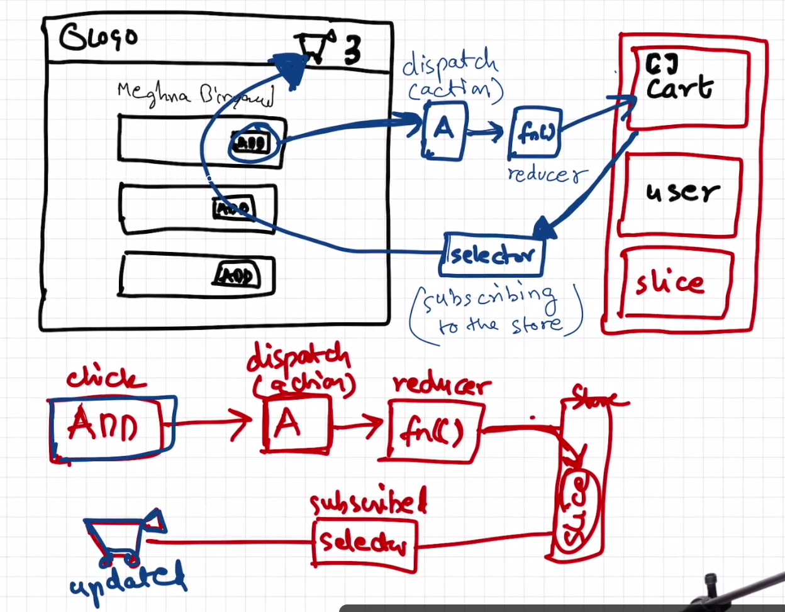

# REDUX TOOLKIT

### Redux Data Flow

## Steps for Redux Toolkit

- Install @reduxjs/toolkit and react-redux
- Build a store
- Connect the store to the app
- Create a Slice (cartSlice)
- Dispatch(Action)
- Selector
- Create Typed Hooks
